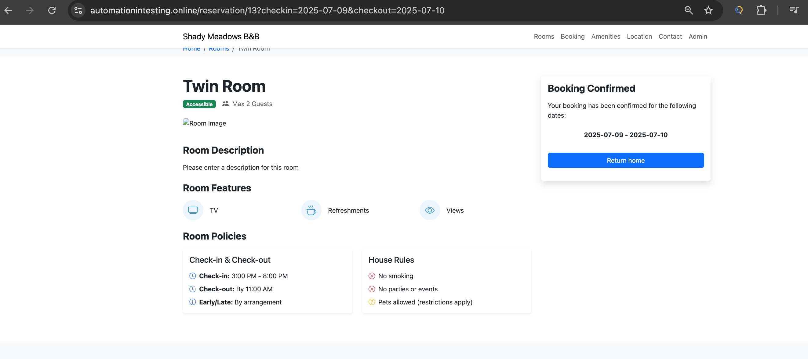
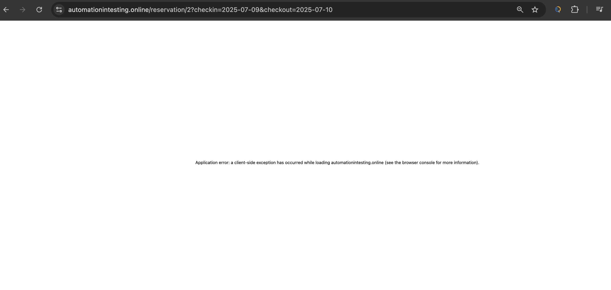
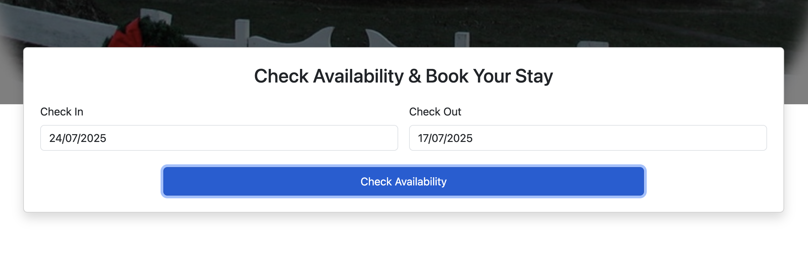
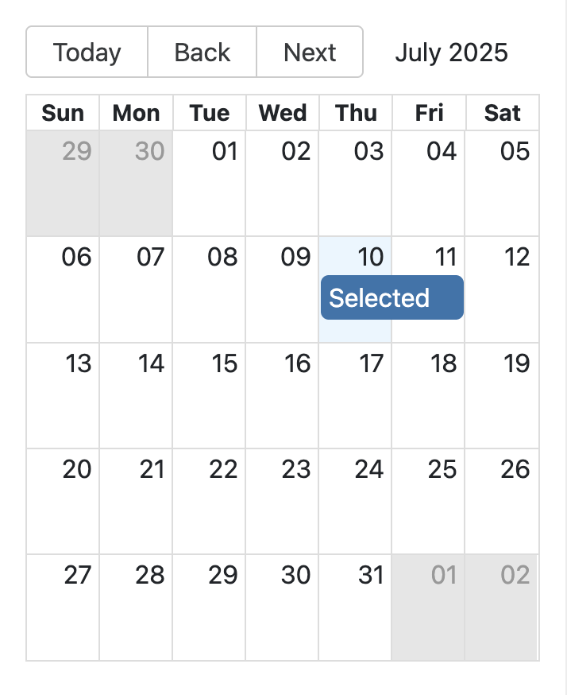

# 🐛 Bug Report

## Title

After submitting a booking, sometimes the page goes into a an error page.

## Description

finish booking the double room and intermittently the error page shows up after submission.

## Steps to Reproduce

1. Go to [https://automationintesting.online]
2. Click the book now button for the double room.
3. Click reserve now button
4. Enter information details.
5. Click the reserve now button

## Expected Result

Booking confirmation should appear...

## Actual Result

AN error page appears...

## Screenshots / Logs

## Environment

- OS: macOS
- Browser: Chrome 133

## Severity

High...

## Reproducible?

Frequently...

=========================================================================================================================================================================================

## Title

Availability date checker allowing future dates for the "Check in" section...

## Description

When the user checks the availability dates, the website allows the user to check in on a future date compared to the check out date......

## Steps to Reproduce

1. Go to [https://automationintesting.online]
2. Click the check in and out dates section.
3. Enter a future date for the check in section.
4. Enter a past date for the check out section.

## Expected Result

The user shouldnt be allowed to select a check in future date from the date that has been selected for the check out date...

## Actual Result

The user can select a future date for the check in...

## Screenshots / Logs

## Environment

- OS: macOS
- Browser: Chrome 133

## Severity

High...

## Reproducible?

Always...

=========================================================================================================================================================================================

## Title

Rooms displays arent loading properly...

## Description

When the user lands on the landing page, the rooms display for the room size selection should load as expected, but sometimes it doesnt load correctly.

## Steps to Reproduce

1. Go to [https://automationintesting.online]
2. Scroll down the our rooms section.

## Expected Result

The user should see the options for the room options load properly.

## Actual Result

The room options doesnt load correctly.

## Screenshots / Logs

## Environment

- OS: macOS
- Browser: Chrome 133

## Severity

High...

## Reproducible?

Frequent...

=========================================================================================================================================================================================

## Title

Other available dates cannot be selected.

## Description

The user cannot select other available dates.

## Steps to Reproduce

1. Go to [https://automationintesting.online]
2. Scroll down the our rooms section.
3. Click the book now button of the room you chose.
4. Click any of the available dates on the calendar.

## Expected Result

The user should be able to select and click the other available dates within the calendar.

## Actual Result

The user isnt able to select and click the other available dates within the calendar.

## Screenshots / Logs

## Environment

- OS: macOS
- Browser: Chrome 133

## Severity

High...

## Reproducible?

Always...

=========================================================================================================================================================================================
